# Data Flow and Process Flows

This document explains how the current Camp Registration app moves data through
the browser, API, service layer, and database. It is written from the source code
that exists today, not from the full product roadmap.

## Quick Mental Model

- The app is a TypeScript monorepo.
- `apps/web` is the Next.js browser application.
- `apps/api` is the Fastify REST API.
- `packages/contracts` defines shared request and response schemas.
- `packages/database` owns PostgreSQL migrations, seed data, and store classes.
- PostgreSQL is the only active persistent store in the implemented flows.
- MinIO and Mailpit exist in local Docker Compose. File storage is not wired in;
  the waitlist worker sends transactional email through SMTP and uses Mailpit
  locally.
- Local development auth is a fixed identity configured by environment variables.
  A real identity provider and auth middleware are not wired in yet.
- The working domains today are catalog, sessions, families, campers, contacts,
  adults, registrations, waitlist offers, offline payments, and attendance.
- Health records, file uploads, online payment collection, refunds, and payment
  webhooks are not implemented yet.

## Source Map

| Area                           | Main files                                                                                                                                                                                                               |
| ------------------------------ | ------------------------------------------------------------------------------------------------------------------------------------------------------------------------------------------------------------------------ |
| Web API client                 | `apps/web/lib/api.ts`                                                                                                                                                                                                    |
| Web proxy for form writes      | `apps/web/app/api/[...path]/route.ts`                                                                                                                                                                                    |
| Dashboard                      | `apps/web/app/page.tsx`                                                                                                                                                                                                  |
| Families UI                    | `apps/web/app/families/**`, `apps/web/components/family-*.tsx`                                                                                                                                                           |
| Parent portal UI               | `apps/web/app/portal/**`, `apps/web/components/registration-checkout-client.tsx`                                                                                                                                         |
| Programs, seasons, sessions UI | `apps/web/app/programs/**`, `apps/web/app/seasons/**`, `apps/web/app/sessions/**`, `apps/web/components/program-create-form.tsx`, `apps/web/components/season-create-form.tsx`, `apps/web/components/session-editor.tsx` |
| API composition                | `apps/api/src/app.ts`, `apps/api/src/server.ts`                                                                                                                                                                          |
| Catalog API                    | `apps/api/src/catalog/routes.ts`, `apps/api/src/catalog/service.ts`                                                                                                                                                      |
| Family API                     | `apps/api/src/families/routes.ts`, `apps/api/src/families/service.ts`                                                                                                                                                    |
| Shared schemas                 | `packages/contracts/src/catalog.ts`, `packages/contracts/src/families.ts`                                                                                                                                                |
| Database stores                | `packages/database/src/catalog-store.ts`, `packages/database/src/family-store.ts`                                                                                                                                        |
| Database schema                | `packages/database/migrations/*.sql`                                                                                                                                                                                     |
| Seed data                      | `packages/database/fixtures/*.json`, `packages/database/src/seed.ts`                                                                                                                                                     |

## System Data Flow

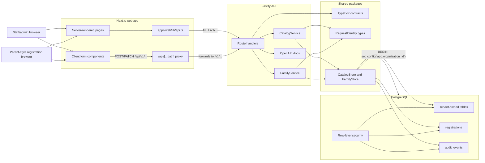

The important split is reads versus writes:

- Server-rendered pages call the API directly from the Next.js server through
  `apps/web/lib/api.ts`.
- Client-side forms write to the Next.js `/api/...` proxy.
- The proxy forwards to Fastify, preserves or creates `x-request-id`, and
  revalidates the main pages after successful writes.

## Read Flow

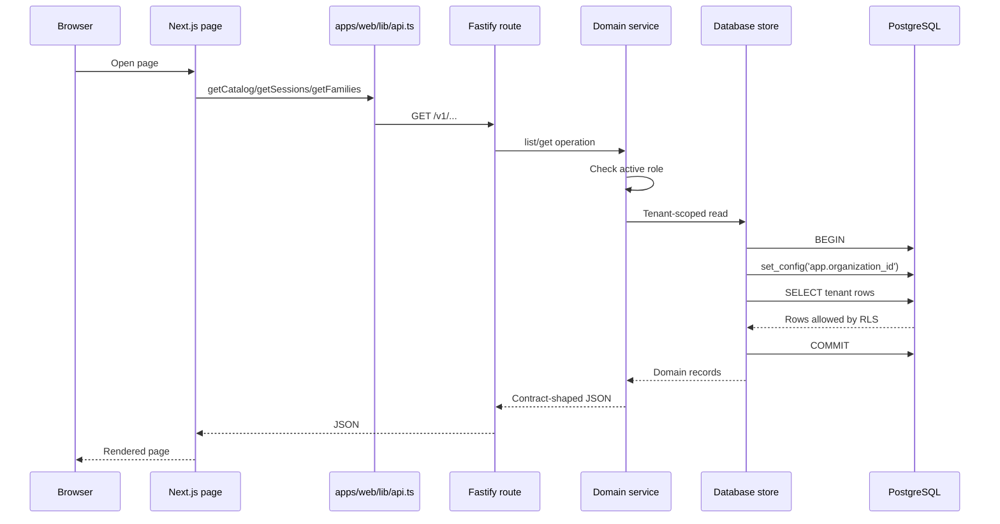

Read examples:

- The dashboard loads catalog and sessions, then computes visible counts.
- The sessions page loads catalog and sessions, then filters by selected season.
- The family detail page loads one family plus all session summaries.
- The parent registration page loads catalog, parent-linked families, all
  session summaries, then fetches detail for each session so the client can
  filter by eligibility.

Current implementation note: `/portal/register` fetches detail for every
session. That is fine for local seed data, but a larger production catalog will
need a more targeted registration-availability endpoint.

## Write Flow

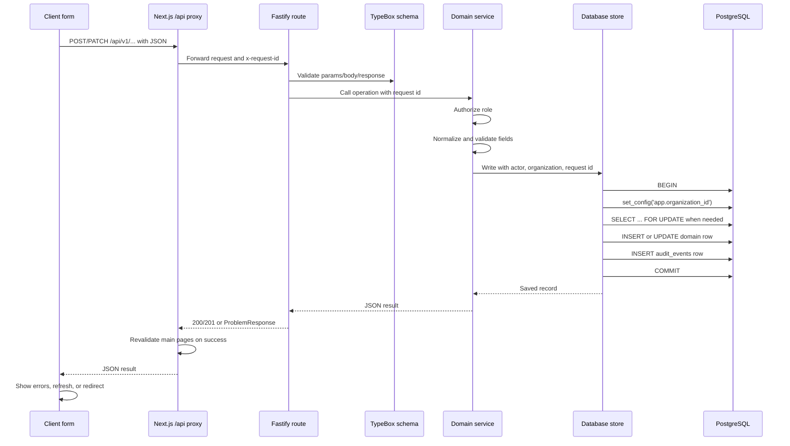

Validation happens in three places:

1. Client forms provide basic required fields and UI feedback.
2. Fastify validates request and response shapes using schemas from
   `packages/contracts`.
3. Services and stores enforce business rules such as roles, dates, versions,
   capacity, duplicate registrations, and tenant references.

Client validation is for usability. The API and database are authoritative.

## Database Model

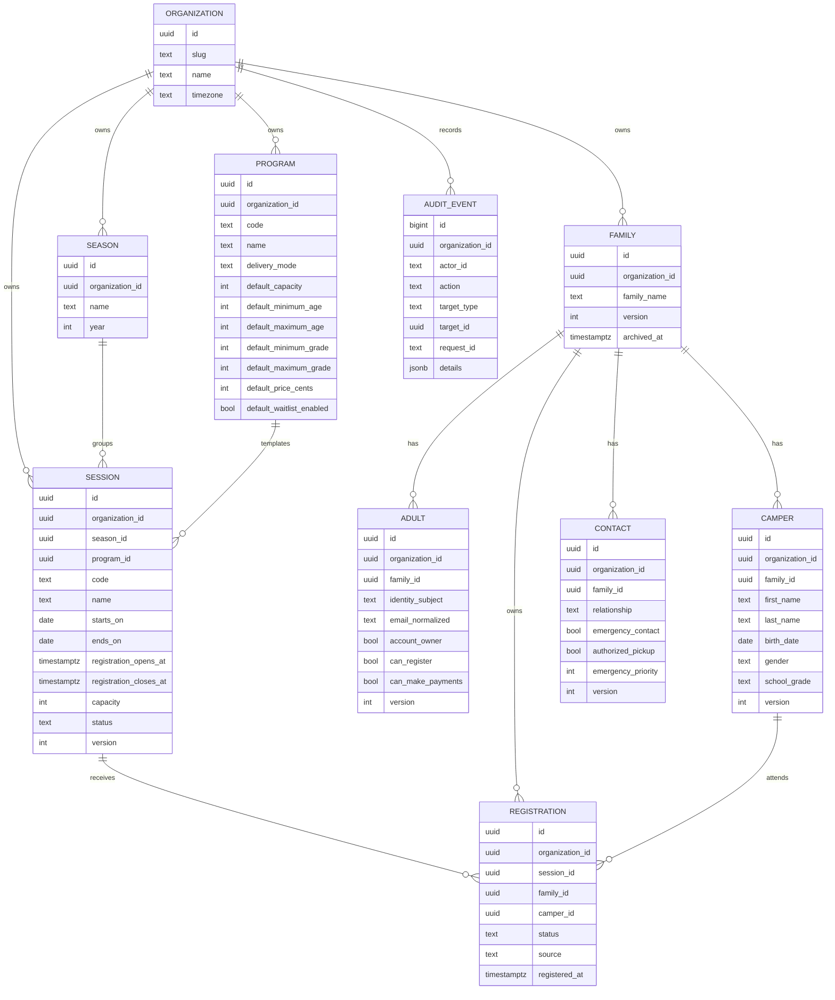

Important database rules:

- Every tenant-owned table has `organization_id`.
- Row-level security is enabled and forced on tenant-owned tables.
- Runtime database access uses the `camp_app` role, not the migration owner.
- Store methods set `app.organization_id` inside each transaction.
- Foreign keys use `(organization_id, id)` style relationships where cross-tenant
  references would be dangerous.
- Writes append metadata-only rows to `audit_events`.
- Updates to family, adult, camper, contact, and session records use optimistic
  `version` checks where the API exposes editable versions.

## Catalog Process Flows

Catalog means organizations, seasons, programs, and sessions.

### Create Season

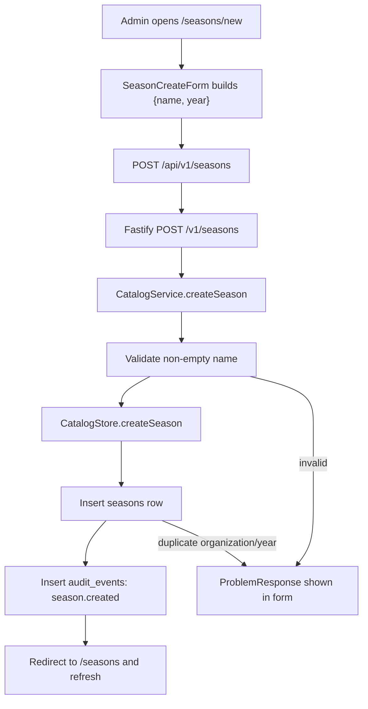

Rules:

- Season years are unique per organization.
- The service trims the season name.
- A successful write records `season.created`.

### Create Or Update Program

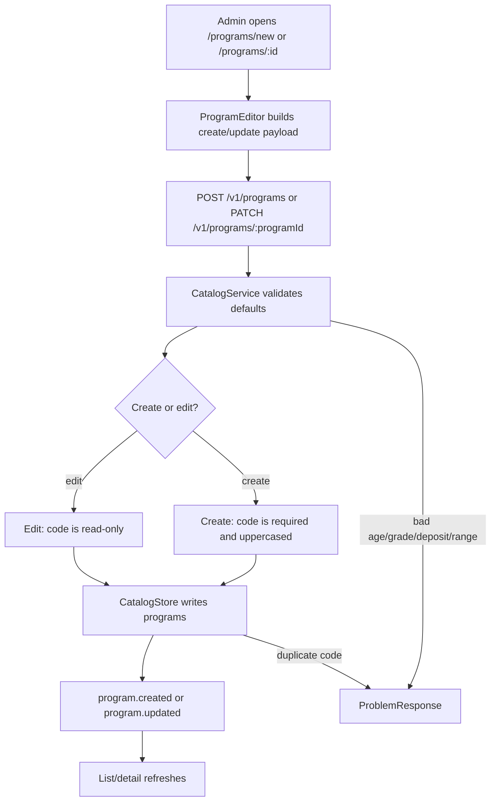

Rules:

- Program code is unique per organization and cannot be edited in the UI.
- Program defaults include capacity, age range, grade range, price, deposit,
  age-as-of rule, and waitlist default.
- Updating a program changes the defaults used for future sessions. It does not
  automatically rewrite existing sessions.

### Create Session

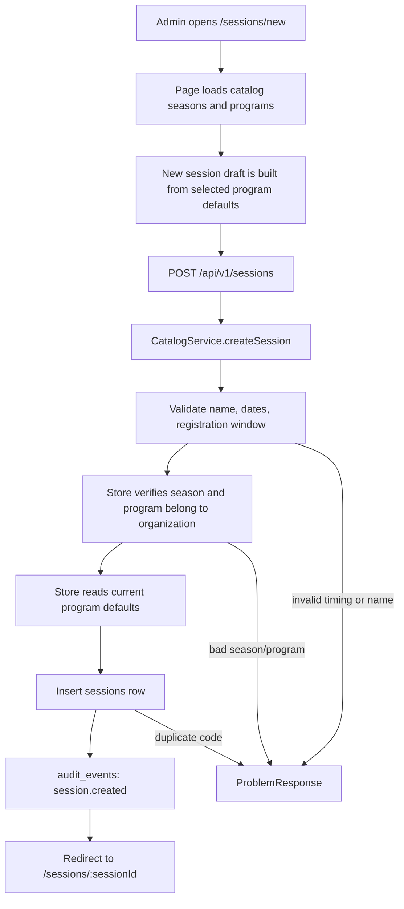

Rules:

- Create payload contains only session identity, dates, program, season, and
  status.
- Capacity, pricing, age bounds, grade bounds, age-as-of, and waitlist setting
  are inherited from the selected program when the store creates the row.
- Session code is unique per organization.

### Update Session

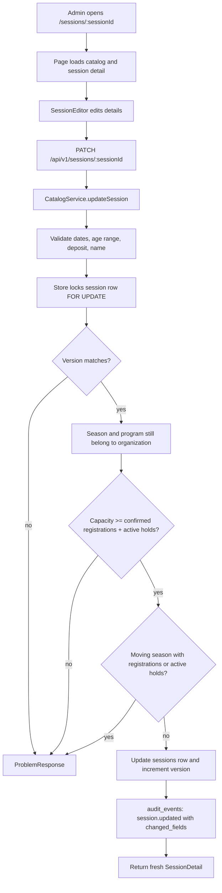

Current implementation notes:

- `active_hold_count` counts unexpired `PENDING` waitlist offers.
- Confirmed registrations and active waitlist offers consume capacity.
  Waitlisted registrations without an active offer do not.
- Existing registrations and active offers block shrinking capacity below the
  reserved total.
- Moving a session to another season is blocked once registrations or active
  holds exist.

## Family Management Process Flow

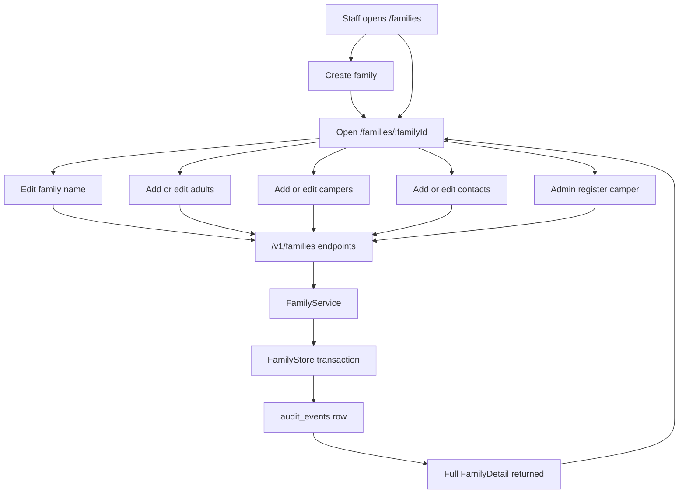

The family detail UI is built around one pattern: every nested write returns a
fresh `FamilyDetail`, and the client replaces its local family state with that
fresh response.

Family records:

- A family is the household/customer record.
- Creating a family only creates the family row. Adults, campers, and contacts
  are added afterward.
- Family updates use `version` to detect stale edits.

Adults:

- Adults represent parents, guardians, or other account-capable people.
- Adult permissions include family owner, manage family, register campers, and
  make payments.
- Adults can also be emergency contacts, authorized pickup contacts, and
  operational communication recipients.
- Email is normalized to lowercase for uniqueness inside a family.
- Multiple family owners are allowed.
- `identity_subject` exists, but invite/claim/link flows are not implemented.

Campers:

- Campers are participants, not login users.
- Camper profile data includes name, birth date, preferred name, gender, school
  grade, cabin preference, and accessibility needs.
- Health records are intentionally not returned by camper profile APIs.
- Active registrations are embedded in camper records when a family detail is
  read.

Contacts:

- Contacts do not have login access.
- A contact must have at least one role: emergency contact, authorized pickup,
  or operational communication.
- Emergency priority only applies when the contact is an emergency contact.

## Admin Registration Flow

Admin registration happens inside the family detail screen.

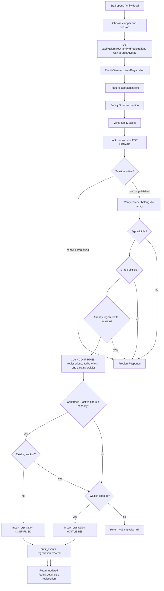

Admin-specific behavior:

- Admin registrations may target draft or published sessions.
- Admin registrations may not target cancelled or archived sessions.
- Admin registrations do not check the public registration open/close window.
- The database still enforces age, grade, duplicate, tenant, and capacity rules.

## Parent Portal Checkout Flow

The `/portal/register` page is the current parent registration flow. It resolves
family access from the linked adult identity and does not expose a family
selector to parents.

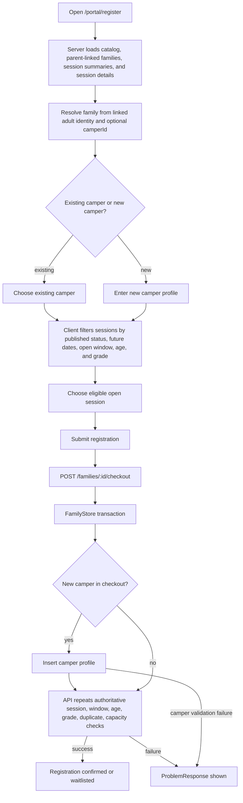

Parent-source behavior:

- Session must be `PUBLISHED`.
- Database transaction time must be inside the registration window.
- Camper must belong to the selected family.
- Camper age and school grade must match the session rules.
- Duplicate registrations are rejected.
- If unreserved capacity is available, the registration is `CONFIRMED`.
- If an existing waitlist remains after stale offers are expired, a new
  registration joins the waitlist even when a seat is open. This preserves
  queue order while staff offers the seat to the next family.
- If capacity is full and waitlist is enabled, the registration is `WAITLISTED`.
- If capacity is full and waitlist is disabled, the API returns
  `capacity_full`.
- When checkout includes a new camper, camper creation and registration happen in
  one database transaction. If registration fails, the new camper insert rolls
  back with it.

## Registration Capacity And Waitlist Flow

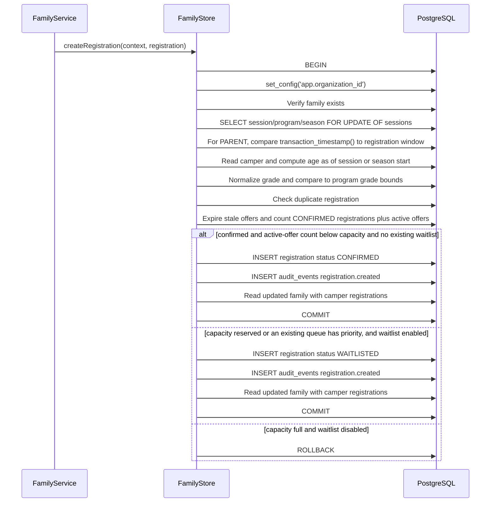

Why the session row lock matters:

- Every registration for the same session must lock the same session row.
- While one transaction is counting confirmed registrations, another transaction
  for the same session waits.
- This serializes capacity decisions for that session.
- The application does not trust browser-displayed counts.

### Time-boxed waitlist offers

- Staff creates an offer for the first eligible waitlisted registration ordered
  by `waitlist_position_at, id`.
- New registrations cannot take an open seat ahead of an existing waitlist.
- The offer uses the tenant-owned organization claim-window policy by default
  and holds one capacity slot while its status is `PENDING` and `expires_at` is
  still in the future. Staff may select a bounded one-off override.
- A linked parent can accept or decline the offer from the parent portal.
- Acceptance atomically changes the offer to `ACCEPTED` and the registration to
  `CONFIRMED` while the session row is locked.
- Decline changes the offer to `DECLINED` and the registration to `CANCELLED`.
- Expiration changes the offer to `EXPIRED`, cancels the waitlisted
  registration, and releases its capacity hold. Expired offers are excluded
  from capacity immediately even before the cleanup write runs.
- Staff creation, parent response, direct registration, and cancellation all
  serialize on the session row so that capacity cannot be double-allocated.
- Staff can resend an active offer, cancel it while preserving queue position,
  or skip it to move the registration to the end of the queue. Cancel and skip
  require an audited reason. The staff UI collects that reason in an accessible
  confirmation dialog that explains the queue effect, validates inline, blocks
  duplicate submission, and restores focus when dismissed.
- The staff session roster displays the authoritative queue number calculated
  from `waitlist_position_at, id`, so the visible order matches offer creation.
- Camp and organization administrators can select one or more registrations and
  move them together to the top, up, down, or bottom. Saving sends both the
  originally loaded order and desired order, requires a reason, locks the
  session, rejects stale edits, rewrites all queue positions atomically, and
  records `waitlist.reordered` with the old and new registration ID lists.
- Grouping is adjacency only. It does not reserve capacity or make offers and
  acceptance atomic across multiple campers. Active offers retain their current
  holds; the edited order controls future offer priority.
- A tenant-scoped worker expires offers, creates the next offers for every open
  seat, queues expiring-soon reminders, and delivers transactional email from a
  PostgreSQL outbox.
- A transition with no eligible adult recipient creates a durable coverage
  issue instead of silently succeeding. Staff can see coverage and terminal
  delivery issues; camp and organization administrators can replay them with
  an audited reason.

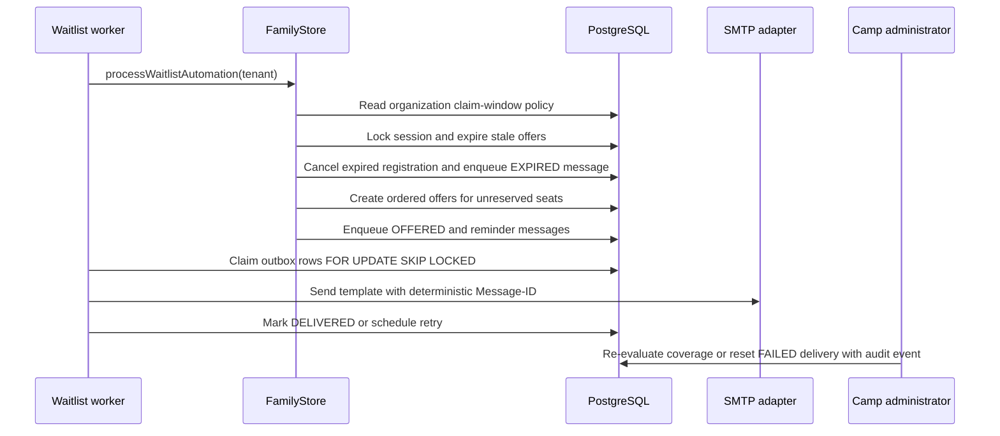

What is not implemented yet:

- There is no independent checkout/cart hold table; `PENDING` waitlist offers
  are the only capacity holds.
- There is no payment step.
- There is no multi-camper atomic sibling checkout.
- SMS, bounce/complaint processing, and a staff dead-letter replay screen are
  not implemented. SMTP delivery uses retryable at-least-once semantics.
- Production tenant discovery is not implemented. Each worker receives an
  explicit organization allowlist so the runtime role never bypasses RLS.
- Registration cancellation is implemented as a status change to `CANCELLED`;
  refund rules and cancellation fees are not implemented yet.

## Error Flow

All domain routes use a shared `ProblemResponse` shape:

```json
{
  "code": "invalid_registration",
  "message": "Camper is not grade eligible for this session",
  "field_errors": {
    "camper_id": "Camper must be in grade 9-12."
  }
}
```

Common status codes:

| Status | Meaning                                                                   |
| ------ | ------------------------------------------------------------------------- |
| `400`  | Invalid input, invalid references, or eligibility failure                 |
| `403`  | Authenticated identity lacks the needed role                              |
| `404`  | Requested family/session/program was not found in the active organization |
| `409`  | Version conflict, duplicate code/registration, or capacity conflict       |
| `503`  | API dependencies are not configured                                       |

Forms read `field_errors` and display messages next to fields where possible.

## Authorization And Tenant Isolation

Current role checks:

| Operation                  | Roles currently allowed                                             |
| -------------------------- | ------------------------------------------------------------------- |
| Read catalog and sessions  | `camp_staff`, `camp_admin`, `organization_admin`                    |
| Edit catalog and sessions  | `camp_admin`, `organization_admin`                                  |
| Read family records        | Staff/admin roles; parents for linked owned families                |
| Edit family records        | `camp_staff`, `camp_admin`, `organization_admin`                    |
| Admin registration         | `camp_staff`, `camp_admin`, `organization_admin`                    |
| Parent-source registration | Staff/admin roles; linked parents with `can_register` or owner flag |

Current parent ownership behavior:

- Parent access is derived from an active adult record whose `identity_subject`
  matches the authenticated actor.
- Parent family lists are filtered to owned families.
- Parent reads and parent-source checkout/cancellation require object-level
  family authorization.
- Adult identity claim exists for local/domain testing: a parent identity with a
  verified matching email can claim an unlinked adult record. Full invite,
  passwordless login, recovery, and provider-backed account management are not
  implemented yet.

Tenant isolation is still enforced in depth:

- API services are constructed per request from the active identity and
  `organizationId`.
- Services find the actor membership for that organization.
- Store methods require organization scope.
- Store transactions set `app.organization_id`.
- PostgreSQL RLS policies use `current_setting('app.organization_id')`.
- Runtime direct queries without tenant context return no tenant rows.

## Audit Events

Current writes append audit rows for:

- `season.created`
- `program.created`
- `program.updated`
- `session.created`
- `session.updated`
- `family.created`
- `family.updated`
- `adult.created`
- `adult.updated`
- `camper.created`
- `camper.updated`
- `contact.created`
- `contact.updated`
- `registration.created`

Audit event details intentionally contain metadata such as changed field names,
registration status, source, session id, camper id, or program code. They do not
store full request bodies, health data, secrets, or payment data.

## Local Development Data Flow

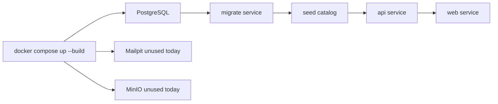

Local runtime identity:

- `LOCAL_AUTH_ENABLED=true`
- `LOCAL_ORGANIZATION_ID=a60b272f-b028-4f1a-b666-3ef3cffd9827`
- `LOCAL_ACTOR_ID=local-camp-admin`
- The API builds a local `RequestIdentity` with `organization_admin`.

Seed data:

- `pnpm db:seed` loads the 2027 MVP catalog.
- `pnpm db:seed:winter-families` loads synthetic family/camper data and
  registration/waitlist examples.
- Fixture assumptions include `America/Chicago` as the sample organization time
  zone and fictional family/contact data.

## Implemented Versus Planned

| Workflow or component                     | Current state                                            |
| ----------------------------------------- | -------------------------------------------------------- |
| Catalog programs, seasons, sessions       | Implemented                                              |
| Family, adult, camper, contact management | Implemented                                              |
| Direct admin registration                 | Implemented                                              |
| Parent-style direct registration          | Implemented as local workflow                            |
| Waitlist insertion when full              | Implemented                                              |
| Time-boxed waitlist offers                | Implemented with parent, staff, and admin queue controls |
| Capacity holds                            | Implemented for unexpired pending waitlist offers        |
| Payments and Stripe webhooks              | Not implemented                                          |
| Health forms and medical data             | Not implemented                                          |
| Transactional waitlist email              | Implemented with SMTP, issue visibility, and replay      |
| File uploads/object storage               | Not implemented                                          |
| Real authentication provider              | Not implemented                                          |
| Parent object ownership checks            | Implemented for family reads, checkout, and cancellation |
| Registration cancellation                 | Implemented                                              |
| Multi-camper atomic checkout              | Not implemented                                          |

## How To Trace A Bug

For a read bug:

1. Find the page under `apps/web/app`.
2. Find which function from `apps/web/lib/api.ts` it calls.
3. Follow the matching API route in `apps/api/src`.
4. Follow the service method.
5. Follow the store method and SQL.
6. Check the contract schema for the response shape.

For a write bug:

1. Find the form component under `apps/web/components`.
2. Find the `/api/v1/...` path it posts or patches.
3. Follow the Next.js proxy in `apps/web/app/api/[...path]/route.ts`.
4. Follow the Fastify route and `sendProblem` mapping.
5. Follow the service validation and authorization.
6. Follow the store transaction, version checks, and audit insert.
7. Check the migration for constraints, RLS policy, and grants.
8. Check route tests and database integration tests for expected behavior.
